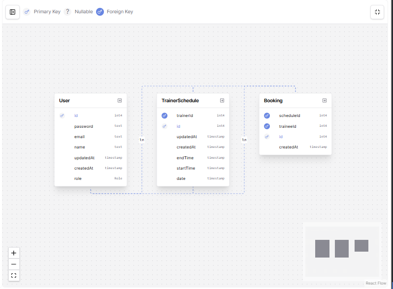

# 🏋️ Gym Class Scheduling and Membership Management System

A backend application for managing gym operations, including **Admins**, **Trainers**, and **Trainees**.  
This system allows scheduling classes, assigning trainers, and booking classes with role-based access control.

---

## 🚀 Project Overview

This project is designed to streamline gym management operations:

- **Admins** → Create trainers, schedule classes, assign trainers.
- **Trainers** → View their assigned schedules.
- **Trainees** → Manage profiles, book, and cancel class schedules.

Key Features:

- Maximum **5 schedules/day**
- Each class lasts **2 hours**
- Each schedule allows **10 trainees max**
- Role-based permissions (Admin, Trainer, Trainee)
- JWT authentication for secure API access

---

## 🗂️ Relational Diagram (ERD)



**Entities:**

- **User** → Admin, Trainer, Trainee
- **Schedule** → Class schedules (belongs to a Trainer)
- **Booking** → Links Trainee with Schedule

---

## 🛠️ Technology Stack

- **Language:** TypeScript
- **Framework:** Express.js
- **Database:** PostgreSQL
- **ORM:** Prisma
- **Authentication:** JWT
- **Validation:** Zod

---

## 📌 API Endpoints

### **Auth**

| Method | Endpoint           | Description         | Access |
| ------ | ------------------ | ------------------- | ------ |
| POST   | `/api/auth/signup` | Register a new user | Public |
| POST   | `/api/auth/login`  | Login and get JWT   | Public |

### **Admin**

| Method | Endpoint                          | Description                    |
| ------ | --------------------------------- | ------------------------------ |
| POST   | `/api/admin/trainers`             | Create a new trainer           |
| GET    | `/api/admin/trainers`             | View all trainers              |
| POST   | `/api/admin/schedules`            | Create a schedule (max 5/day)  |
| GET    | `/api/admin/schedules`            | View all schedules             |
| PATCH  | `/api/admin/schedules/:id/assign` | Assign a trainer to a schedule |
| DELETE | `/api/admin/schedules/:id`        | Delete a schedule              |

### **Trainer**

| Method | Endpoint                 | Description             |
| ------ | ------------------------ | ----------------------- |
| GET    | `/api/trainer/schedules` | View assigned schedules |

### **Trainee**

| Method | Endpoint                    | Description              |
| ------ | --------------------------- | ------------------------ |
| POST   | `/api/trainee/profile`      | Create or update profile |
| GET    | `/api/trainee/profile`      | View own profile         |
| POST   | `/api/trainee/bookings`     | Book a class schedule    |
| GET    | `/api/trainee/bookings`     | View bookings            |
| DELETE | `/api/trainee/bookings/:id` | Cancel a booking         |

### **Public**

| Method | Endpoint         | Description              |
| ------ | ---------------- | ------------------------ |
| GET    | `/api/schedules` | View available schedules |

---

## 🗄️ Database Schema (Prisma Models)

```prisma
model User {
  id        Int       @id @default(autoincrement())
  name      String
  email     String    @unique
  password  String
  role      Role
  createdAt DateTime  @default(now())
  updatedAt DateTime  @updatedAt
  schedules Schedule[] @relation("TrainerSchedules")
  bookings  Booking[]
}

model Schedule {
  id        Int       @id @default(autoincrement())
  date      DateTime
  startTime DateTime
  endTime   DateTime
  trainer   User      @relation("TrainerSchedules", fields: [trainerId], references: [id])
  trainerId Int
  bookings  Booking[]
}

model Booking {
  id         Int       @id @default(autoincrement())
  trainee    User      @relation(fields: [traineeId], references: [id])
  traineeId  Int
  schedule   Schedule  @relation(fields: [scheduleId], references: [id])
  scheduleId Int
  createdAt  DateTime  @default(now())
}

enum Role {
  ADMIN
  TRAINER
  TRAINEE
}
```

### 1. Clone the repository

git clone https://github.com/your-username/gym-class-scheduling.git
cd gym-class-scheduling

### 2. Install dependencies

npm install

### 3. Setup database and environment

cp .env.example .env

### Update .env with your PostgreSQL connection string

### 4. Migrate database

npx prisma migrate dev

### 5. Start the server

npm run dev
